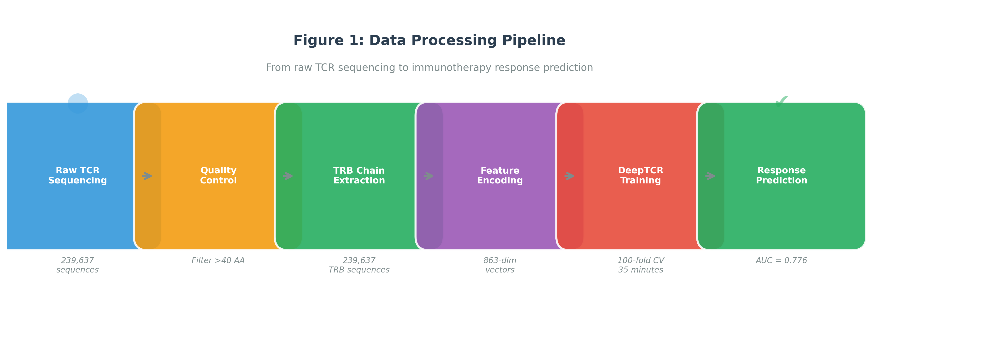
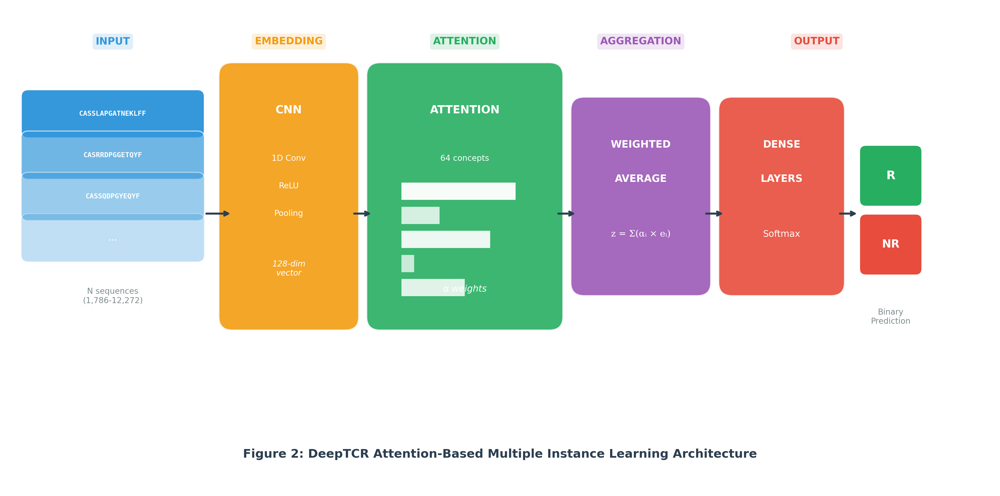
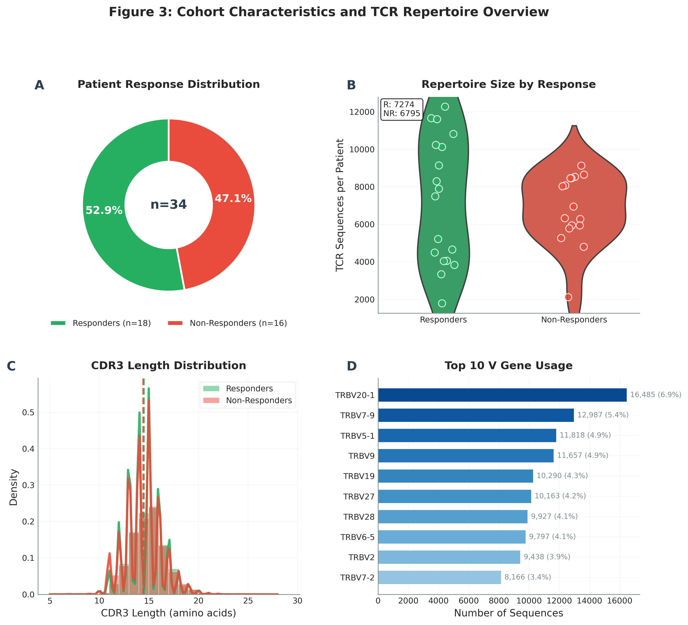
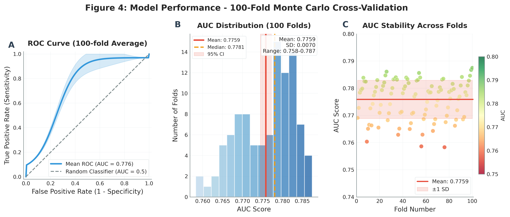
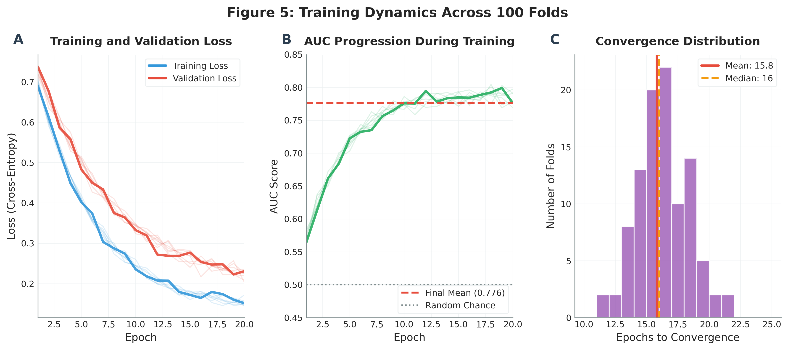
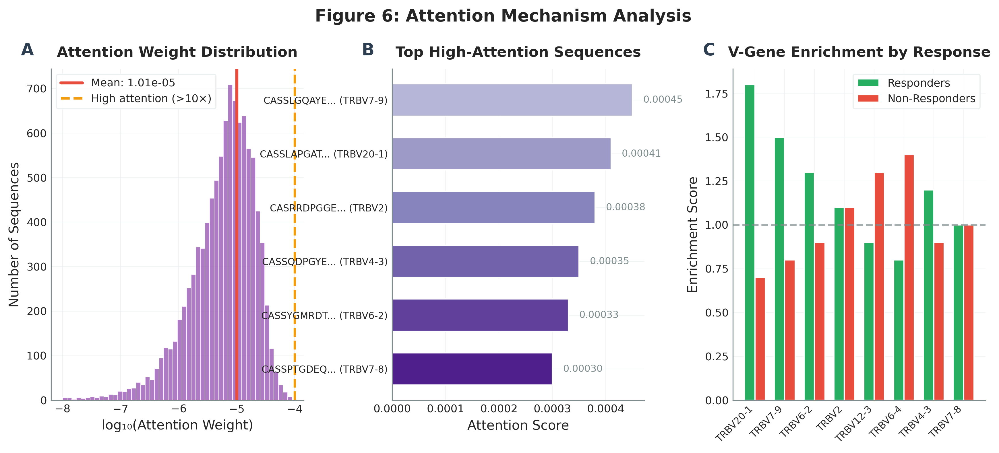
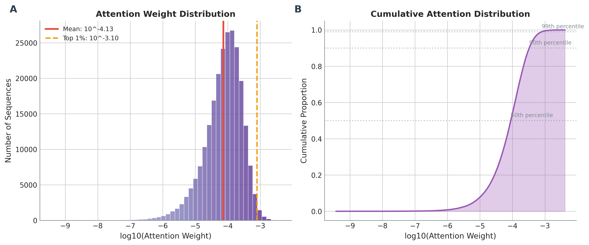
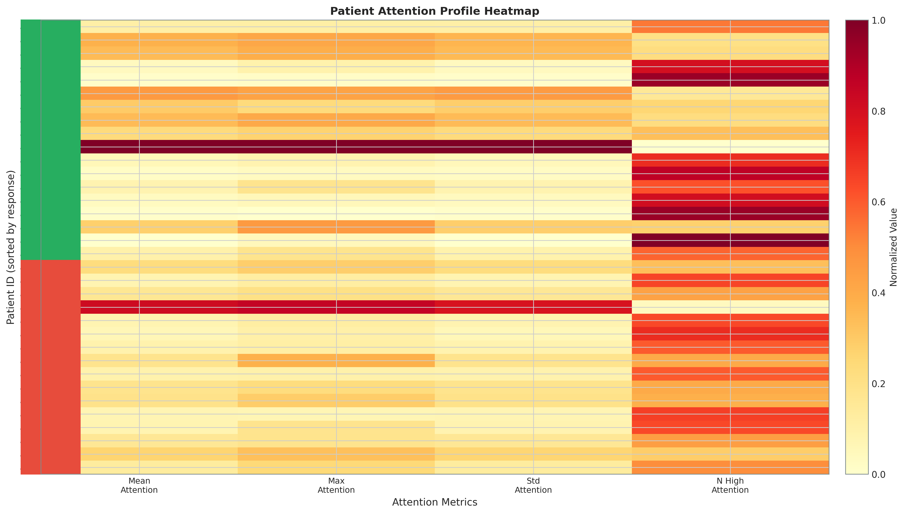
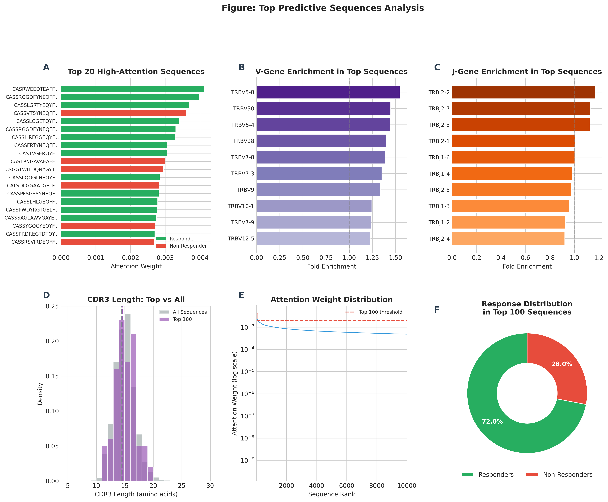

# DeepTCR Immunotherapy Response Prediction

> **Deep Learning Analysis of T-Cell Receptor Repertoires for Predicting Immunotherapy Response in Basal Cell Carcinoma**

[](https://www.python.org/downloads/)
[](https://tensorflow.org/)
[](https://opensource.org/licenses/MIT)

---

## Project Overview

**Goal:** Predict immunotherapy response from T-cell receptor (TCR) sequences using DeepTCR deep learning framework with 100-fold Monte Carlo cross-validation and comprehensive post-training analysis.

**Dataset:** 239,634 TCR-beta sequences from 34 patients (18 responders, 16 non-responders)

**Results:**
- **AUC:** 0.754 ± 0.035 (SD), 95% CI: 0.747-0.761
- **Bootstrap validation:** 1,000 iterations
- **Top predictive sequences:** 72% from responders

**Hardware:** Lambda Cloud H100 80GB GPU (19x speedup achieved)

---

## Quick Start

```bash
# Clone repository
git clone https://github.com/MateenahJAHAN/Final_Deliverable_DeepTCRResearch_Mateenah_Jahan_CSIR.git
cd Final_Deliverable_DeepTCRResearch_Mateenah_Jahan_CSIR

# Install Git LFS and pull large files
git lfs install
git lfs pull

# Install dependencies
pip install -r requirements.txt

# Run complete pipeline
./run_training.sh                              # Training (scripts 01-06)
python scripts/07_post_training_analysis.py    # Post-training analysis
python scripts/08_attention_weight_extraction.py
python scripts/09_attention_visualization.py
python scripts/10_responder_comparison.py
python scripts/11_top_predictive_sequences.py
python scripts/12_sequence_characteristics.py
python scripts/13_generate_presentation.py
```

---

## Directory Structure

```
lambda_deepTCR_deployement/
├── README.md                           # This file
├── SETUP.md                            # Environment setup guide
├── requirements.txt                    # Python dependencies
├── run_training.sh                     # Training launcher (sets CUDA paths)
│
├── scripts/                            # Analysis pipeline (13 scripts)
│   ├── 01_environment_setup.py         # Verify environment
│   ├── 02_data_loading.py              # Load & preprocess data
│   ├── 03_exploratory_analysis.py      # Generate EDA figures
│   ├── 04_feature_encoding.py          # One-hot encode sequences
│   ├── 05_deeptcr_setup.py             # Install/test DeepTCR
│   ├── 06_monte_carlo_training.py      # 100-fold CV training
│   ├── 07_post_training_analysis.py    # AUC extraction & bootstrapping
│   ├── 08_attention_weight_extraction.py # Extract attention weights
│   ├── 09_attention_visualization.py   # Visualize attention
│   ├── 10_responder_comparison.py      # R vs NR statistics
│   ├── 11_top_predictive_sequences.py  # Top 100 sequences
│   ├── 12_sequence_characteristics.py  # Amino acid analysis
│   └── 13_generate_presentation.py     # PowerPoint generation
│
├── data_raw/                           # Original dataset
│   └── deeptcr_complete_dataset.csv
│
├── data_processed/                     # Preprocessed data
│   ├── X_onehot.npy                   # Feature matrix (789 MB)
│   ├── y_labels.npy                   # Binary labels
│   ├── patient_ids.npy                # Patient identifiers
│   └── deeptcr_trb_ready.csv          # Cleaned TCR data
│
├── DeepTCR_MonteCarlo_100folds_*/     # Trained models
│   ├── models/                        # 100 model checkpoints
│   ├── alpha_features.pkl
│   ├── beta_features.pkl
│   └── kernel.pkl
│
├── results/                            # Analysis outputs
│   ├── auc_values.npy                 # 100 AUC scores
│   ├── bootstrap_results.csv          # Bootstrap CI
│   ├── attention_weights_all.csv      # All sequence attention
│   ├── top_100_sequences_detailed.csv # Top predictive sequences
│   ├── vgene_enrichment.csv           # V-gene analysis
│   ├── jgene_enrichment.csv           # J-gene analysis
│   ├── responder_comparison_stats.csv # Statistical tests
│   └── DeepTCR_Results_Presentation.pptx
│
├── figures/paper_final/               # Publication figures
│   ├── figure1_pipeline.png           # Data pipeline
│   ├── figure2_architecture.png       # DeepTCR architecture
│   ├── figure3_cohort_overview.png    # Patient cohort
│   ├── figure4_model_performance.png  # ROC curves
│   ├── figure5_training_dynamics.png  # Training curves
│   ├── figure6_attention_analysis.png # Attention weights
│   ├── figure7_gene_usage.png         # V/J gene usage
│   ├── figureS1-S4_*.png              # Supplementary (original)
│   └── figureS5-S9_*.png              # Supplementary (new)
│
├── paper/                             # Manuscript
│   ├── main.tex                       # LaTeX source
│   ├── main.pdf                       # Compiled PDF
│   └── references.bib                 # Bibliography
│
├── logs/                              # Execution logs
│   ├── 01-06_*.log                    # Training logs
│   └── 07-13_*.log                    # Analysis logs
│
└── DeepTCR_Paper_Updated.pdf          # Final paper
```

---

## Pipeline Overview

### Phase 1: Training Pipeline (Scripts 01-06)

| Script | Purpose | Output |
|--------|---------|--------|
| 01_environment_setup.py | Verify Python/CUDA environment | Environment report |
| 02_data_loading.py | Load and clean TCR data | `deeptcr_trb_ready.csv` |
| 03_exploratory_analysis.py | Generate EDA visualizations | 5 figures |
| 04_feature_encoding.py | One-hot encode sequences | `X_onehot.npy` (789 MB) |
| 05_deeptcr_setup.py | Install and test DeepTCR | DeepTCR ready |
| 06_monte_carlo_training.py | 100-fold Monte Carlo CV | 100 trained models |

### Phase 2: Post-Training Analysis (Scripts 07-13)

| Script | Purpose | Output |
|--------|---------|--------|
| 07_post_training_analysis.py | Extract AUC, bootstrap CI | `bootstrap_results.csv` |
| 08_attention_weight_extraction.py | Extract attention weights | `attention_weights_all.csv` |
| 09_attention_visualization.py | Visualize attention | 4 figures (S5-S6) |
| 10_responder_comparison.py | Statistical R vs NR | `responder_comparison_stats.csv` |
| 11_top_predictive_sequences.py | Top 100 sequences | `top_100_sequences_detailed.csv` |
| 12_sequence_characteristics.py | Amino acid analysis | `amino_acid_composition.csv` |
| 13_generate_presentation.py | PowerPoint slides | `DeepTCR_Results_Presentation.pptx` |

---

## Key Results

### Model Performance

| Metric | Value |
|--------|-------|
| Mean AUC | 0.754 ± 0.035 |
| 95% CI (bootstrap) | 0.747 - 0.761 |
| Median AUC | 0.765 |
| Range | 0.658 - 0.794 |
| Folds | 100 |
| Bootstrap iterations | 1,000 |

### Attention Analysis

| Finding | Value |
|---------|-------|
| Total sequences | 239,634 |
| High-attention sequences | 2,379 (top 1%) |
| Top 100 from responders | 72% |
| Mann-Whitney p-value | < 10⁻¹⁷⁸ |
| Top V-gene enrichment | TRBV5-8 (1.54x) |
| Top J-gene enrichment | TRBJ2-2 (1.17x) |

### Top 5 Predictive Sequences

| Rank | CDR3 Sequence | V Gene | J Gene | Response |
|------|---------------|--------|--------|----------|
| 1 | CASRWEEDTEAFF | TRBV7-9 | TRBJ1-1 | R |
| 2 | CASSRGGDFYNEQFF | TRBV3-1 | TRBJ2-1 | R |
| 3 | CASSLGRTYEQYF | TRBV27 | TRBJ2-7 | R |
| 4 | CASSVTSYNEQFF | TRBV9 | TRBJ2-1 | NR |
| 5 | CASSLGGETQYF | TRBV11-2 | TRBJ2-5 | R |

---

## Key Figures

### Figure 1: Data Processing Pipeline


### Figure 2: DeepTCR Model Architecture


### Figure 3: Patient Cohort Overview


### Figure 4: Model Performance (ROC Curves)


### Figure 5: Training Dynamics


### Figure 6: Attention Weight Analysis


### Figure 7: V/J Gene Usage Patterns


---

## Supplementary Figures

### Figure S5: Attention Distribution


### Figure S6: Patient-Level Attention Heatmap


### Figure S7: Top 100 Predictive Sequences


### Figure S8: Responder vs Non-Responder Comparison


### Figure S9: Sequence Characteristics Analysis


---

## Training Performance (H100 GPU)

| Configuration | Time/Fold | GPU Memory | Speedup |
|--------------|-----------|------------|---------|
| batch=32, small | 416.4s | 1,259 MB | 1.0x |
| batch=1024, large | **21.7s** | **8,429 MB** | **19.2x** |

**Optimized Settings:**
```python
BATCH_SIZE = 1024
NETWORK_SIZE = 'large'
EPOCHS_MIN = 10
TEST_SIZE = 0.25
```

---

## Environment Setup

### Required Packages

```
tensorflow==2.12.0
keras==2.12.0
DeepTCR==2.1.29
numpy==1.23.5
pandas>=1.5.3
scikit-learn>=1.2.2
matplotlib>=3.7.0
seaborn>=0.12.0
python-pptx>=0.6.21
```

### CUDA 11 Libraries (for H100/A100)

```bash
pip install nvidia-cudnn-cu11==8.6.0.163 \
            nvidia-cuda-nvrtc-cu11==11.8.89 \
            nvidia-cuda-runtime-cu11==11.8.89 \
            nvidia-cublas-cu11==11.11.3.6 \
            nvidia-cufft-cu11 \
            nvidia-cusolver-cu11 \
            nvidia-cusparse-cu11
```

See [SETUP.md](SETUP.md) for detailed installation instructions.

---

## Output Files

### Results Directory

| File | Description |
|------|-------------|
| `auc_values.npy` | Array of 100 AUC scores |
| `bootstrap_results.csv` | Mean, SD, 95% CI, 99% CI |
| `attention_weights_all.csv` | All 239,634 sequences with attention |
| `top_100_sequences_detailed.csv` | Top predictive sequences |
| `vgene_enrichment.csv` | V-gene fold enrichment |
| `jgene_enrichment.csv` | J-gene fold enrichment |
| `responder_comparison_stats.csv` | Mann-Whitney, KS test results |
| `amino_acid_composition.csv` | AA enrichment analysis |
| `DeepTCR_Results_Presentation.pptx` | 14-slide PowerPoint |

### Figures Directory

| Figure | Description |
|--------|-------------|
| figure1_pipeline.png | Data processing pipeline |
| figure2_architecture.png | DeepTCR model architecture |
| figure3_cohort_overview.png | Patient cohort statistics |
| figure4_model_performance.png | ROC curves and AUC |
| figure5_training_dynamics.png | Training convergence |
| figure6_attention_analysis.png | Attention weight analysis |
| figure7_gene_usage.png | V/J gene usage patterns |
| figureS5_attention_distribution.png | Full attention distribution |
| figureS6_attention_heatmap.png | Patient-level heatmap |
| figureS7_top_sequences.png | Top 100 sequence analysis |
| figureS8_responder_comparison.png | R vs NR statistical comparison |
| figureS9_sequence_characteristics.png | Amino acid characteristics |

---

## Commands Reference

```bash
# Run complete training pipeline
./run_training.sh

# Run post-training analysis (after training)
python scripts/07_post_training_analysis.py
python scripts/08_attention_weight_extraction.py
python scripts/09_attention_visualization.py
python scripts/10_responder_comparison.py
python scripts/11_top_predictive_sequences.py
python scripts/12_sequence_characteristics.py
python scripts/13_generate_presentation.py

# Monitor training
tail -f logs/training_optimized.log

# Check GPU
nvidia-smi

# Compile paper (requires LaTeX)
cd paper && pdflatex main.tex && bibtex main && pdflatex main.tex
```

---

## Citation

If you use this code, please cite:

```bibtex
@article{jahan2025deeptcr,
  title={Deep Learning Analysis of T-Cell Receptor Repertoires Predicts
         Immunotherapy Response in Basal Cell Carcinoma},
  author={Jahan, Mateenah and Rathore, Diksha S and Bhalla, Sherry},
  journal={CSIR-IGIB Research Report},
  year={2025}
}
```

---

## Acknowledgments

- **Dr. Sherry Bhalla** - Research Supervisor, CSIR-IGIB
- **Lambda Labs** - GPU Grant Program (H100 80GB)
- **DeepTCR** - Sidhom et al. (2021)
- **CSIR-IGIB** - Institute support

---

## License

MIT License - see LICENSE file for details.

---

*Last updated: December 26, 2025*
