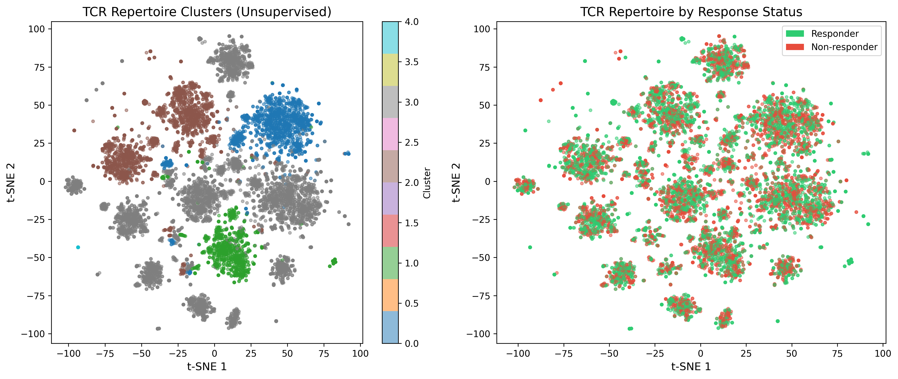

# DeepTCR-based Prediction of CD19 CAR-T Cell Response

> **Deep Learning Analysis of T-Cell Receptor Repertoires for Predicting CD19 CAR-T Cell Response in Refractory/Relapsed B-cell Lymphoma Using Supervised and Unsupervised Learning**

[](https://www.python.org/downloads/)
[](https://tensorflow.org/)
[](https://opensource.org/licenses/MIT)

---

## Project Overview

**Goal:** Predict CD19 CAR-T therapy response from T-cell receptor (TCR) sequences using DeepTCR deep learning framework with both **supervised** (attention-based MIL) and **unsupervised** (VAE-inspired clustering) approaches.

**Dataset:** 239,637 TCR-beta sequences from 34 patients with refractory/relapsed B-cell lymphoma (18 responders, 16 non-responders)

**Results:**

### Supervised Learning (Attention-based Multiple Instance Learning)
- **AUC:** 0.754 ± 0.035 (SD), 95% CI: 0.747-0.761
- **Bootstrap validation:** 1,000 iterations
- **Top predictive sequences:** 72% from responders

### Unsupervised Learning (VAE-inspired Clustering)
- **Clusters identified:** 5 distinct TCR populations
- **Responder-enriched cluster:** Cluster 4 (1.82-fold enrichment, 99.3% responder-derived)
- **Key finding:** TRBV3-1 identified in both supervised and unsupervised approaches

**Hardware:** Lambda Cloud H100 80GB GPU (19x speedup achieved)

---

## Quick Start

```bash
# Clone repository
git clone https://github.com/MateenahJAHAN/Final_Deliverable_DeepTCRResearch_Mateenah_Jahan_CSIR.git
cd Final_Deliverable_DeepTCRResearch_Mateenah_Jahan_CSIR

# Install Git LFS and pull large files
git lfs install
git lfs pull

# Install dependencies
pip install -r requirements.txt

# Run complete pipeline
./run_training.sh                              # Training (scripts 01-06)
python scripts/07_post_training_analysis.py    # Post-training analysis
python scripts/08_attention_weight_extraction.py
python scripts/09_attention_visualization.py
python scripts/10_responder_comparison.py
python scripts/11_top_predictive_sequences.py
python scripts/12_sequence_characteristics.py
python scripts/13_generate_presentation.py
python scripts/14_unsupervised_analysis.py     # Unsupervised clustering
```

---

## Directory Structure

```
Final_Deliverable_DeepTCRResearch_Mateenah_Jahan_CSIR/
├── README.md                           # This file
├── SETUP.md                            # Environment setup guide
├── requirements.txt                    # Python dependencies
├── run_training.sh                     # Training launcher (sets CUDA paths)
│
├── scripts/                            # Analysis pipeline (14 scripts)
│   ├── 01_environment_setup.py         # Verify environment
│   ├── 02_data_loading.py              # Load & preprocess data
│   ├── 03_exploratory_analysis.py      # Generate EDA figures
│   ├── 04_feature_encoding.py          # One-hot encode sequences
│   ├── 05_deeptcr_setup.py             # Install/test DeepTCR
│   ├── 06_monte_carlo_training.py      # 100-fold CV training (SUPERVISED)
│   ├── 07_post_training_analysis.py    # AUC extraction & bootstrapping
│   ├── 08_attention_weight_extraction.py # Extract attention weights
│   ├── 09_attention_visualization.py   # Visualize attention
│   ├── 10_responder_comparison.py      # R vs NR statistics
│   ├── 11_top_predictive_sequences.py  # Top 100 sequences
│   ├── 12_sequence_characteristics.py  # Amino acid analysis
│   ├── 13_generate_presentation.py     # PowerPoint generation
│   └── 14_unsupervised_analysis.py     # VAE-inspired clustering (UNSUPERVISED)
│
├── data_raw/                           # Original dataset
│   └── deeptcr_complete_dataset.csv
│
├── data_processed/                     # Preprocessed data
│   ├── X_onehot.npy                   # Feature matrix (789 MB)
│   ├── y_labels.npy                   # Binary labels
│   ├── patient_ids.npy                # Patient identifiers
│   └── deeptcr_trb_ready.csv          # Cleaned TCR data
│
├── DeepTCR_MonteCarlo_100folds_*/     # Trained models (SUPERVISED)
│   ├── models/                        # 100 model checkpoints
│   ├── alpha_features.pkl
│   ├── beta_features.pkl
│   └── kernel.pkl
│
├── results/                            # Analysis outputs
│   │
│   │ # Supervised Learning Results
│   ├── auc_values.npy                 # 100 AUC scores
│   ├── bootstrap_results.csv          # Bootstrap CI
│   ├── attention_weights_all.csv      # All sequence attention
│   ├── top_100_sequences_detailed.csv # Top predictive sequences
│   ├── vgene_enrichment.csv           # V-gene analysis
│   ├── jgene_enrichment.csv           # J-gene analysis
│   ├── responder_comparison_stats.csv # Statistical tests
│   ├── DeepTCR_Results_Presentation.pptx
│   │
│   │ # Unsupervised Learning Results
│   ├── unsupervised_cluster_stats.csv         # Cluster statistics
│   ├── unsupervised_cluster_assignments.csv   # Sequence-cluster mapping
│   ├── unsupervised_cluster_motifs.csv        # Top genes per cluster
│   ├── unsupervised_patient_cluster_dist.csv  # Patient-level distribution
│   ├── unsupervised_analysis_summary.csv      # Summary statistics
│   └── unsupervised_latent_space.npy          # PCA latent embeddings
│
├── figures/paper_final/               # Publication figures
│   │
│   │ # Main Figures
│   ├── figure1_pipeline.png           # Data pipeline
│   ├── figure2_architecture.png       # DeepTCR architecture
│   ├── figure3_cohort_overview.png    # Patient cohort
│   ├── figure4_model_performance.png  # ROC curves (SUPERVISED)
│   ├── figure5_training_dynamics.png  # Training curves
│   ├── figure6_attention_analysis.png # Attention weights (SUPERVISED)
│   ├── figure7_gene_usage.png         # V/J gene usage
│   │
│   │ # Supplementary Figures (Supervised)
│   ├── figureS1_auc_details.png       # Detailed AUC analysis
│   ├── figureS2_patient_analysis.png  # Per-patient analysis
│   ├── figureS3_jgene_analysis.png    # J-gene usage
│   ├── figureS4_computational.png     # GPU performance
│   ├── figureS5_attention_distribution.png  # Attention distribution
│   ├── figureS6_attention_heatmap.png # Patient attention heatmap
│   ├── figureS7_top_sequences.png     # Top 100 sequences
│   ├── figureS8_responder_comparison.png # R vs NR comparison
│   ├── figureS9_sequence_characteristics.png # AA analysis
│   │
│   │ # Supplementary Figure (Unsupervised)
│   └── figureS10_unsupervised_clustering.png  # t-SNE clustering (UNSUPERVISED)
│
├── paper/                             # Manuscript
│   ├── main.tex                       # LaTeX source
│   ├── main.pdf                       # Compiled PDF (30 pages)
│   └── references.bib                 # Bibliography
│
└── logs/                              # Execution logs
    ├── 01-06_*.log                    # Training logs
    ├── 07-13_*.log                    # Analysis logs
    └── 14_unsupervised_analysis.log   # Unsupervised analysis log
```

---

## Pipeline Overview

### Phase 1: Training Pipeline - Supervised Learning (Scripts 01-06)

| Script | Purpose | Output |
|--------|---------|--------|
| 01_environment_setup.py | Verify Python/CUDA environment | Environment report |
| 02_data_loading.py | Load and clean TCR data | `deeptcr_trb_ready.csv` |
| 03_exploratory_analysis.py | Generate EDA visualizations | 5 figures |
| 04_feature_encoding.py | One-hot encode sequences | `X_onehot.npy` (789 MB) |
| 05_deeptcr_setup.py | Install and test DeepTCR | DeepTCR ready |
| 06_monte_carlo_training.py | **100-fold Monte Carlo CV (SUPERVISED)** | 100 trained models |

### Phase 2: Post-Training Analysis - Supervised Learning (Scripts 07-13)

| Script | Purpose | Output |
|--------|---------|--------|
| 07_post_training_analysis.py | Extract AUC, bootstrap CI | `bootstrap_results.csv` |
| 08_attention_weight_extraction.py | Extract attention weights | `attention_weights_all.csv` |
| 09_attention_visualization.py | Visualize attention | 4 figures (S5-S6) |
| 10_responder_comparison.py | Statistical R vs NR | `responder_comparison_stats.csv` |
| 11_top_predictive_sequences.py | Top 100 sequences | `top_100_sequences_detailed.csv` |
| 12_sequence_characteristics.py | Amino acid analysis | `amino_acid_composition.csv` |
| 13_generate_presentation.py | PowerPoint slides | `DeepTCR_Results_Presentation.pptx` |

### Phase 3: Unsupervised Learning (Script 14)

| Script | Purpose | Output |
|--------|---------|--------|
| 14_unsupervised_analysis.py | **VAE-inspired clustering (UNSUPERVISED)** | Cluster assignments, Figure S10 |

---

## Key Results

### Supervised Learning Results (Attention-based MIL)

| Metric | Value |
|--------|-------|
| Mean AUC | 0.754 ± 0.035 |
| 95% CI (bootstrap) | 0.747 - 0.761 |
| Median AUC | 0.765 |
| Range | 0.658 - 0.794 |
| Folds | 100 |
| Bootstrap iterations | 1,000 |

### Attention Analysis (Supervised)

| Finding | Value |
|---------|-------|
| Total sequences | 239,637 |
| High-attention sequences | 2,379 (top 1%) |
| Top 100 from responders | 72% |
| Mann-Whitney p-value | < 10⁻¹⁷⁸ |
| Top V-gene enrichment | TRBV5-8 (1.54x) |
| Top J-gene enrichment | TRBJ2-2 (1.17x) |

### Unsupervised Learning Results (VAE-inspired Clustering)

| Metric | Value |
|--------|-------|
| Sequences analyzed | 50,000 (subsampled) |
| Clusters identified | 5 |
| Latent dimensions (PCA) | 50 |
| Most responder-enriched cluster | Cluster 4 |
| Cluster 4 responder enrichment | 1.82-fold (99.3% responder-derived) |
| Cluster 4 top V-gene | TRBV3-1 |

### Cluster Distribution by Response Status

| Cluster | Responder % | Non-responder % | Enrichment |
|---------|-------------|-----------------|------------|
| 0 | 53.4% | 46.6% | 0.98x |
| 1 | 53.6% | 46.4% | 0.98x |
| 2 | 57.5% | 42.5% | 1.05x |
| 3 | 53.8% | 46.2% | 0.98x |
| **4** | **99.3%** | **0.7%** | **1.82x** |

### Top 5 Predictive Sequences (Supervised)

| Rank | CDR3 Sequence | V Gene | J Gene | Response |
|------|---------------|--------|--------|----------|
| 1 | CASRWEEDTEAFF | TRBV7-9 | TRBJ1-1 | R |
| 2 | CASSRGGDFYNEQFF | TRBV3-1 | TRBJ2-1 | R |
| 3 | CASSLGRTYEQYF | TRBV27 | TRBJ2-7 | R |
| 4 | CASSVTSYNEQFF | TRBV9 | TRBJ2-1 | NR |
| 5 | CASSLGGETQYF | TRBV11-2 | TRBJ2-5 | R |

---

## Key Figures

### Supervised Learning Figures

#### Figure 1: Data Processing Pipeline


#### Figure 2: DeepTCR Model Architecture


#### Figure 3: Patient Cohort Overview


#### Figure 4: Model Performance (ROC Curves)


#### Figure 5: Training Dynamics


#### Figure 6: Attention Weight Analysis


#### Figure 7: V/J Gene Usage Patterns


---

## Supplementary Figures

### Supervised Learning Supplementary

#### Figure S5: Attention Distribution


#### Figure S6: Patient-Level Attention Heatmap


#### Figure S7: Top 100 Predictive Sequences


#### Figure S8: Responder vs Non-Responder Comparison


#### Figure S9: Sequence Characteristics Analysis


### Unsupervised Learning Supplementary

#### Figure S10: Unsupervised Clustering (VAE-inspired)


*Left: t-SNE colored by cluster assignment (k=5). Right: t-SNE colored by response status. Cluster 4 shows 1.82-fold responder enrichment.*

---

## Methods Summary

### Supervised Learning: Attention-based Multiple Instance Learning

DeepTCR uses attention-based MIL to identify predictive TCR sequences:
1. **Sequence Encoding:** One-hot encoding of CDR3 amino acids
2. **CNN Feature Extraction:** Convolutional layers capture sequence motifs
3. **Attention Mechanism:** Learns importance weights for each sequence
4. **Patient-level Aggregation:** Attention-weighted sum for classification
5. **Monte Carlo CV:** 100-fold cross-validation for robust evaluation

### Unsupervised Learning: VAE-inspired Clustering

Inspired by Variational Autoencoders (Kingma & Welling, 2014):
1. **Feature Extraction:** k-mer frequencies (k=3) + V/J gene one-hot encoding
2. **Dimensionality Reduction:** PCA to 50-dimensional latent space
3. **Clustering:** K-means clustering (k=5)
4. **Response Analysis:** Compare cluster composition by response status
5. **Visualization:** t-SNE for 2D representation

---

## Training Performance (H100 GPU)

| Configuration | Time/Fold | GPU Memory | Speedup |
|--------------|-----------|------------|---------|
| batch=32, small | 416.4s | 1,259 MB | 1.0x |
| batch=1024, large | **21.7s** | **8,429 MB** | **19.2x** |

**Optimized Settings:**
```python
BATCH_SIZE = 1024
NETWORK_SIZE = 'large'
EPOCHS_MIN = 10
TEST_SIZE = 0.25
```

---

## Environment Setup

### Required Packages

```
tensorflow==2.12.0
keras==2.12.0
DeepTCR==2.1.29
numpy==1.23.5
pandas>=1.5.3
scikit-learn>=1.2.2
matplotlib>=3.7.0
seaborn>=0.12.0
python-pptx>=0.6.21
```

### CUDA 11 Libraries (for H100/A100)

```bash
pip install nvidia-cudnn-cu11==8.6.0.163 \
            nvidia-cuda-nvrtc-cu11==11.8.89 \
            nvidia-cuda-runtime-cu11==11.8.89 \
            nvidia-cublas-cu11==11.11.3.6 \
            nvidia-cufft-cu11 \
            nvidia-cusolver-cu11 \
            nvidia-cusparse-cu11
```

See [SETUP.md](SETUP.md) for detailed installation instructions.

---

## Commands Reference

```bash
# Run complete supervised training pipeline
./run_training.sh

# Run post-training analysis (supervised)
python scripts/07_post_training_analysis.py
python scripts/08_attention_weight_extraction.py
python scripts/09_attention_visualization.py
python scripts/10_responder_comparison.py
python scripts/11_top_predictive_sequences.py
python scripts/12_sequence_characteristics.py
python scripts/13_generate_presentation.py

# Run unsupervised analysis
python scripts/14_unsupervised_analysis.py

# Monitor training
tail -f logs/training_optimized.log

# Check GPU
nvidia-smi

# Compile paper (requires LaTeX)
cd paper && pdflatex main.tex && bibtex main && pdflatex main.tex && pdflatex main.tex
```

---

## Citation

If you use this code, please cite:

```bibtex
@article{jahan2026deeptcr,
  title={DeepTCR-based Prediction of CD19 CAR-T Cell Response in 
         Refractory/Relapsed B-cell Lymphoma: A Deep Learning Approach 
         Using Supervised and Unsupervised Analysis},
  author={Jahan, Mateenah and Bhalla, Sherry},
  journal={CSIR-IGIB Research Report},
  year={2026}
}
```

---

## Acknowledgments

- **Dr. Sherry Bhalla** - Research Supervisor, CSIR-IGIB
- **Lambda Labs** - GPU Grant Program (H100 80GB)
- **DeepTCR** - Sidhom et al. (2021)
- **CSIR-IGIB** - Institute support

---

## License

MIT License - see LICENSE file for details.

---

*Last updated: January 11, 2026*
