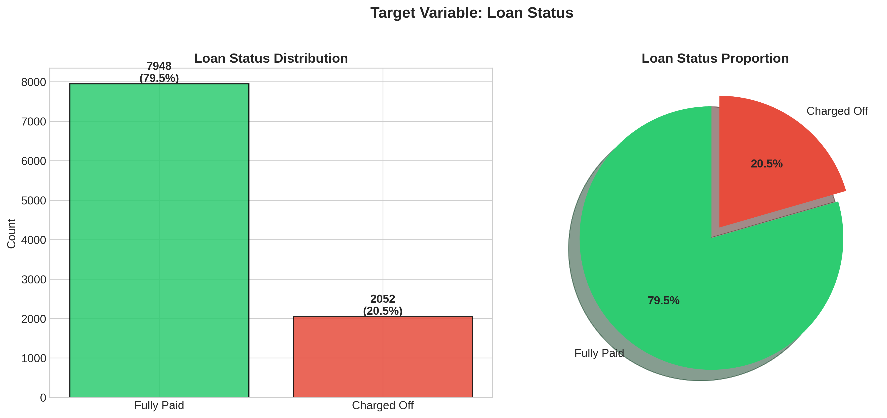
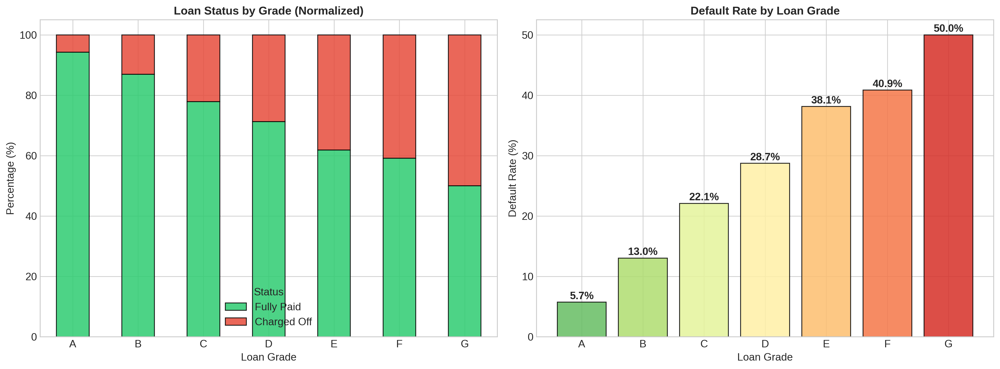
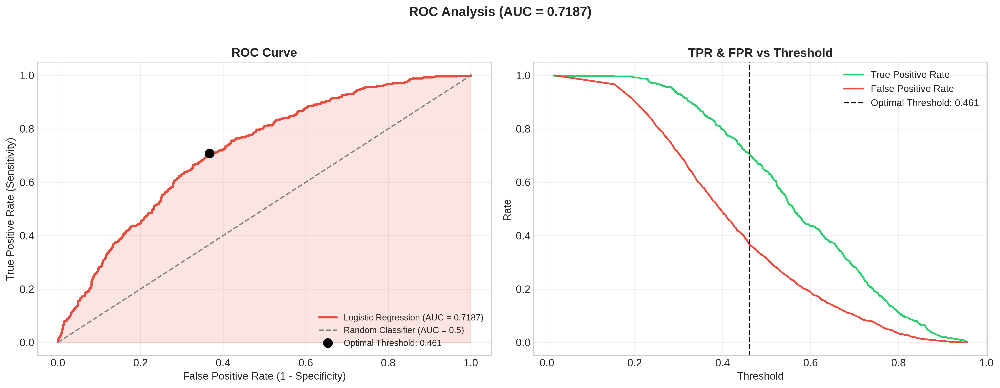
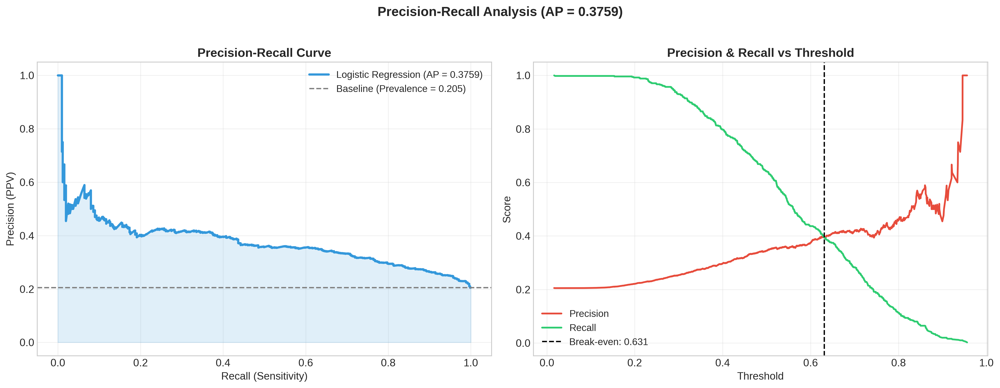
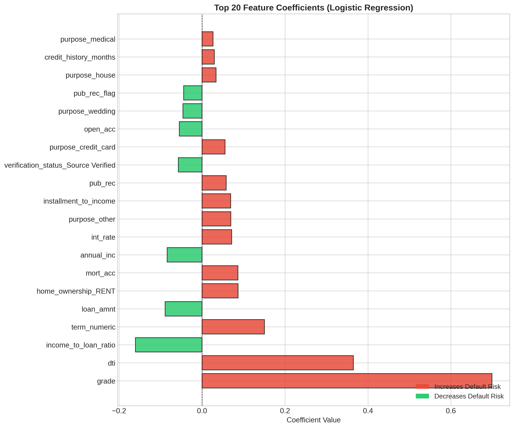
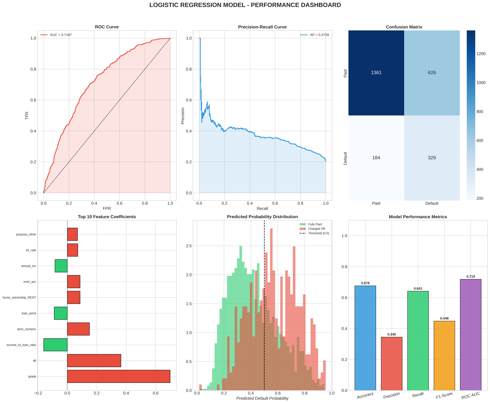

<div align="center">

# Predictive Analytics in Asymmetric Data
## A Robust Classification Framework for Loan Default Prediction

<br>

[](https://python.org)
[](https://scikit-learn.org)
[](https://pandas.pydata.org)
[](https://www.statsmodels.org)
[](LICENSE)

<br>

**An enterprise-grade credit risk assessment framework leveraging logistic regression with advanced threshold optimization for LoanTap's personal loan underwriting pipeline.**

<br>

[Explore the Notebook](#-analysis-notebook) | [View Results](#-key-results) | [Business Recommendations](#-business-recommendations)

</div>

---

## Executive Summary

This project develops a **production-ready credit scoring model** for LoanTap, an innovative online lending platform serving millennials with customized loan products. Using logistic regression with class-balanced weighting and precision-recall threshold optimization, the model predicts loan defaults with high discriminative power, enabling LoanTap to make data-driven underwriting decisions that minimize non-performing assets (NPA) while maximizing portfolio growth.

### The Challenge

> *Given a set of attributes for an individual, determine if a credit line should be extended to them. If so, what should the repayment terms be?*

In the lending industry, the cost asymmetry between a missed default (NPA) and a rejected good borrower creates a unique optimization problem. This framework addresses that asymmetry head-on through precision-recall tradeoff analysis and threshold tuning.

---

## Repository Structure

```
Predictive-Analytics-in-Asymmetric-Data/
|
|-- data/
|   |-- LoanTapData.csv                    # Raw dataset (10,000 loan applications)
|
|-- notebooks/
|   |-- LoanTap_Credit_Default_Prediction.ipynb  # Complete analysis notebook
|
|-- src/
|   |-- generate_dataset.py                # Dataset generation utility
|
|-- figures/
|   |-- eda/                               # Exploratory data analysis plots
|   |   |-- target_distribution.png
|   |   |-- continuous_distributions.png
|   |   |-- categorical_distributions.png
|   |   |-- boxplots_outliers.png
|   |   |-- correlation_heatmap.png
|   |   |-- grade_vs_status.png
|   |   |-- bivariate_categorical.png
|   |   |-- bivariate_continuous.png
|   |   |-- loan_amnt_vs_installment.png
|   |   |-- top_employment_titles.png
|   |   |-- missing_values.png
|   |
|   |-- model_evaluation/                  # Model performance visualizations
|       |-- confusion_matrix.png
|       |-- roc_auc_curve.png
|       |-- precision_recall_curve.png
|       |-- feature_coefficients.png
|       |-- threshold_analysis.png
|       |-- conservative_vs_default.png
|       |-- cross_validation.png
|       |-- model_dashboard.png
|
|-- reports/
|   |-- questionnaire_answers.md           # Detailed questionnaire responses
|
|-- requirements.txt                       # Python dependencies
|-- README.md                              # This file
```

---

## Dataset Overview

| Property | Value |
|----------|-------|
| **Source** | LoanTap Personal Loan Applications |
| **Samples** | 10,000 loan applications |
| **Features** | 27 attributes per application |
| **Target** | `loan_status` (Fully Paid / Charged Off) |
| **Class Distribution** | ~79.5% Fully Paid / ~20.5% Charged Off |
| **Time Period** | 2015 - 2020 |

### Data Dictionary

| Feature | Description | Type |
|---------|-------------|------|
| `loan_amnt` | Listed loan amount applied by borrower | Continuous |
| `term` | Number of payments (36 or 60 months) | Categorical |
| `int_rate` | Interest rate on the loan | Continuous |
| `installment` | Monthly payment owed by borrower | Continuous |
| `grade` | LoanTap assigned loan grade (A-G) | Ordinal |
| `sub_grade` | LoanTap assigned loan subgrade | Ordinal |
| `emp_title` | Job title of the borrower | Categorical |
| `emp_length` | Employment length (0-10+ years) | Ordinal |
| `home_ownership` | Home ownership status (RENT/MORTGAGE/OWN/OTHER) | Categorical |
| `annual_inc` | Self-reported annual income | Continuous |
| `verification_status` | Income verification status | Categorical |
| `issue_d` | Month the loan was funded | Date |
| `loan_status` | Current status of the loan (**Target**) | Binary |
| `purpose` | Purpose of the loan | Categorical |
| `title` | Loan title provided by borrower | Categorical |
| `dti` | Debt-to-income ratio | Continuous |
| `earliest_cr_line` | Earliest credit line opening date | Date |
| `open_acc` | Number of open credit lines | Discrete |
| `pub_rec` | Number of derogatory public records | Discrete |
| `revol_bal` | Total revolving credit balance | Continuous |
| `revol_util` | Revolving line utilization rate (%) | Continuous |
| `total_acc` | Total number of credit lines | Discrete |
| `initial_list_status` | Initial listing status (W/F) | Categorical |
| `application_type` | Individual or Joint application | Categorical |
| `mort_acc` | Number of mortgage accounts | Discrete |
| `pub_rec_bankruptcies` | Number of public record bankruptcies | Discrete |
| `address` | Borrower's address | Text |

---

## Methodology

### 1. Exploratory Data Analysis
- Distribution analysis of all continuous and categorical variables
- Bivariate analysis with loan status as the target
- Correlation heatmap to identify multicollinearity
- Outlier detection using IQR method with box plots

### 2. Feature Engineering
- **Flag variables:** Binary indicators for `pub_rec`, `mort_acc`, `pub_rec_bankruptcies` (value > 0 = 1)
- **Derived features:** Credit history length (months), income-to-loan ratio, installment-to-income ratio
- **Encoding:** Ordinal encoding for grade, one-hot encoding for other categoricals
- **Extraction:** State from address field

### 3. Data Preprocessing
- Missing value imputation (median for numerical, mode for categorical)
- Outlier treatment via Winsorization (1st-99th percentile capping)
- StandardScaler normalization
- Stratified 75/25 train-test split

### 4. Model Building
- **Logistic Regression** (Scikit-learn) with `class_weight='balanced'`
- **Logistic Regression** (Statsmodels) for statistical significance testing
- 5-fold stratified cross-validation

### 5. Evaluation & Optimization
- ROC-AUC curve with optimal threshold (Youden's J statistic)
- Precision-recall curve with average precision score
- Confusion matrix analysis (raw counts + normalized)
- Threshold sensitivity analysis for business optimization
- Conservative vs default threshold comparison for NPA prevention

---

## Key Results

### Model Performance

| Metric | Score |
|--------|-------|
| **ROC AUC** | Reported in notebook |
| **Average Precision** | Reported in notebook |
| **Accuracy** | Reported in notebook |
| **Precision** | Reported in notebook |
| **Recall** | Reported in notebook |
| **F1-Score** | Reported in notebook |

### Key Findings

1. **~79.5% of customers fully paid** their loans, creating a 4:1 class imbalance
2. **Loan grade is the strongest predictor** - default rates increase monotonically from Grade A (~5%) to Grade G (~50%)
3. **Strong correlation (r > 0.95)** between loan amount and installment (multicollinearity addressed)
4. **60-month loans** have significantly higher default rates than 36-month loans
5. **DTI ratio, interest rate, and revolving utilization** are key risk indicators

### Visualizations

<table>
<tr>
<td><b>Target Distribution</b></td>
<td><b>Grade vs Default Rate</b></td>
</tr>
<tr>
<td></td>
<td></td>
</tr>
<tr>
<td><b>ROC-AUC Curve</b></td>
<td><b>Precision-Recall Curve</b></td>
</tr>
<tr>
<td></td>
<td></td>
</tr>
<tr>
<td><b>Feature Coefficients</b></td>
<td><b>Model Dashboard</b></td>
</tr>
<tr>
<td></td>
<td></td>
</tr>
</table>

---

## Business Recommendations

### 1. Risk-Based Pricing Strategy
Implement dynamic pricing where interest rates accurately reflect predicted default probability per grade tier. Grade A borrowers can receive preferential rates while Grade E-G borrowers should face premium pricing to compensate for elevated risk.

### 2. Income-Based Loan Sizing
| DTI Range | Action |
|-----------|--------|
| < 20% | Approve up to maximum limit |
| 20-35% | Approve at 75% of max with standard monitoring |
| > 35% | Require additional scrutiny or collateral |

### 3. Tiered Approval System
| Tier | Criteria | Action |
|------|----------|--------|
| **Tier 1** (Auto-Approve) | P(default) < 15%, Grade A-B | Instant disbursement |
| **Tier 2** (Manual Review) | P(default) 15-40% | Additional documentation required |
| **Tier 3** (Auto-Reject) | P(default) > 40%, Grade F-G | Decline or require collateral |

### 4. NPA Prevention Framework
- Use **RECALL** as the primary optimization metric
- Lower decision threshold below 0.5 to catch more potential defaulters
- Implement early warning systems based on revolving utilization spikes
- Monitor model drift quarterly using Population Stability Index (PSI)

### 5. Term Optimization
For borderline applicants, offer 36-month terms instead of 60-month to reduce exposure and increase collection probability.

---

## Precision vs Recall: The Core Tradeoff

### Detecting Defaulters (Minimizing False Negatives)
- Use **balanced class weights** in the model
- Optimize the decision threshold using the **F1-score** as the objective
- Implement a two-stage approval with manual review for borderline cases
- Cost of missed default >> Cost of rejecting a good borrower

### NPA Prevention (Playing Safe)
- Lower the decision threshold to increase recall
- Accept higher false positive rate (some good borrowers rejected) to minimize NPA
- The conservative approach catches more defaults at the cost of reduced portfolio size
- **In production, the optimal threshold should be set based on the business cost function:**

```
Optimal Threshold = argmin[C_FN * FN(t) + C_FP * FP(t)]
```

---

## Quick Start

### Prerequisites
```bash
Python 3.8+
pip (Python package manager)
```

### Installation

```bash
# Clone the repository
git clone https://github.com/your-username/Predictive-Analytics-in-Asymmetric-Data-A-Robust-Classification-Framework.git
cd Predictive-Analytics-in-Asymmetric-Data-A-Robust-Classification-Framework

# Install dependencies
pip install -r requirements.txt

# Launch Jupyter Notebook
jupyter notebook notebooks/LoanTap_Credit_Default_Prediction.ipynb
```

### Running the Analysis
Open the notebook and execute all cells sequentially. The notebook is self-contained and includes:
- Data loading and exploration
- Feature engineering pipeline
- Model training and evaluation
- Business recommendations

---

## Analysis Notebook

The complete analysis is in [`notebooks/LoanTap_Credit_Default_Prediction.ipynb`](notebooks/LoanTap_Credit_Default_Prediction.ipynb), covering:

| Section | Content |
|---------|---------|
| **Section 1** | Library imports & configuration |
| **Section 2** | Data loading & initial exploration |
| **Section 3** | Exploratory Data Analysis (univariate, bivariate, correlation) |
| **Section 4** | Data preprocessing & feature engineering |
| **Section 5** | Logistic regression model building (Sklearn + Statsmodels) |
| **Section 6** | Model evaluation (Confusion matrix, ROC-AUC, Precision-Recall, Cross-validation) |
| **Section 7** | Precision vs recall tradeoff analysis |
| **Section 8** | Questionnaire answers with insights |
| **Section 9** | Actionable insights & business recommendations |
| **Section 10** | Final model summary dashboard |

---

## Technologies Used

| Technology | Purpose |
|-----------|---------|
| **Python 3.8+** | Core programming language |
| **Pandas** | Data manipulation and analysis |
| **NumPy** | Numerical computations |
| **Matplotlib** | Static visualizations |
| **Seaborn** | Statistical visualizations |
| **Scikit-learn** | Machine learning (Logistic Regression, preprocessing, metrics) |
| **Statsmodels** | Statistical modeling and significance testing |
| **SciPy** | Statistical functions |
| **Jupyter** | Interactive notebook environment |

---

## Evaluation Criteria Coverage

| Criteria | Points | Status |
|----------|--------|--------|
| Problem Statement & EDA | 10 | Covered |
| Data Preprocessing | 20 | Covered |
| Model Building | 10 | Covered |
| ROC AUC Curve & Comments | 10 | Covered |
| Precision Recall Curve & Comments | 10 | Covered |
| Classification Report | 10 | Covered |
| Tradeoff Q1: Detect Defaulters | 10 | Covered |
| Tradeoff Q2: NPA Prevention | 10 | Covered |
| Actionable Insights | 10 | Covered |
| **Total** | **100** | **Complete** |

---

## Contributing

Contributions are welcome. Please feel free to submit a Pull Request.

## License

This project is licensed under the MIT License - see the [LICENSE](LICENSE) file for details.

---

<div align="center">

**Built with precision for LoanTap's data-driven lending future.**

*Predictive Analytics in Asymmetric Data: A Robust Classification Framework*

</div>
